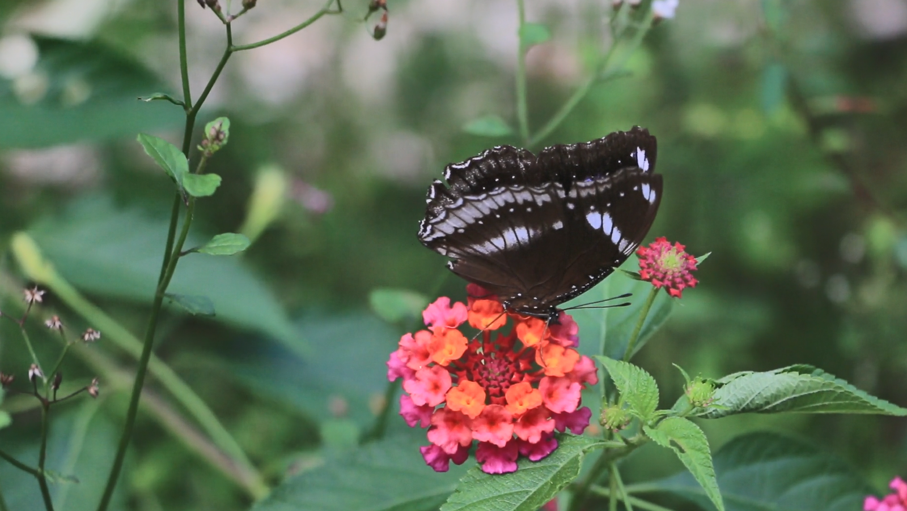

# Butterfly Wing Motion Tracker (Dense Optical Flow with ROI Masking)

Video Source: https://www.pexels.com/video/a-butterfly-on-a-flower-9672686/

This project tracks and visualizes the motion of butterfly wings using dense optical flow (Farneback method).
It focuses exclusively on the butterfly area by applying a custom mask and filters out background noise like leaves and flowers.
All outputs (images and videos) are automatically saved inside Google Drive.

# Project Structure
Dense Optical Flow (Farneback) for pixel-wise motion tracking.

ROI Masking: Focus only on the butterfly region.

Motion Thresholding: Visualize only fast wing movements (ignoring slow background).

Video Output: Save the processed motion visualization as .mp4.

Google Drive Saving: Results are directly saved into Drive folders.

# How It Works
Mount Google Drive.

Load input butterfly video.

Crop the video between 14s and 20s.

Compute dense optical flow on each frame.

Apply a region mask to restrict motion tracking to the butterfly.

Filter out low-speed or static motions.

Generate and save a motion visualization video to Google Drive.

# Requirements
Python 3.x
OpenCV (opencv-python)
Google Colab (recommended) or a local machine with Google Drive access
Install required libraries:
bash
Copy
Edit
pip install opencv-python
If using Google Colab, simply mount Google Drive (no extra installation needed).
# How to Run
Place your butterfly video inside Google Drive, for example:
swift
Copy
Edit
/MyDrive/Butterfly Motion Track/Butterflywing.mp4
Run the tracking script:

python
Copy
Edit
analyze_butterfly('/content/drive/MyDrive/Butterfly Motion Track/Butterflywing.mp4')
Outputs will be saved at:

swift
Copy
Edit
/MyDrive/ButterflyDenseTrackingResults/results_YYYY_MMDD/
Contents:

butterfly_wing_motion_masked.mp4 (masked butterfly wing motion visualization)

#Result
Only butterfly wings moving are visualized.
Background and flowers are fully masked and hidden.
A clean .mp4 motion video is produced.

